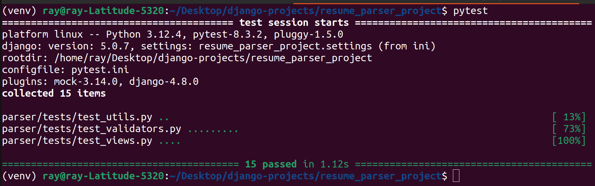

# 📄 Django + AI Resume Parser

A web application that extracts structured information (name, email, education, experience, skills) from unstructured resumes using **Django** and an AI-powered backend. This project integrates machine learning (via **LLaMA**) to enhance parsing accuracy and flexibility across different resume formats.

---

## 🧰 Tools & Services

* **Backend:** Django (Python Framework)
* **Testing:** Pytest
* **AI/NLP:** LLaMA Machine Learning Model
* **Frontend:** HTML/CSS
* **Document Parsing:** PyMuPDF, python-docx

---

## 🖥️ Landing Page


---

## ✅ Unit Testing Preview



---

## 🛠️ Features

* Parse resumes in **PDF, DOC, and DOCX** formats
* Extract and convert unstructured resume text into **clean JSON**
* Built-in **test suite** using `pytest` to ensure parsing accuracy
* Simple and responsive web interface

---

## 📌 How to Use

1. **Clone the repository**

   ```bash
   git clone https://github.com/yourusername/Resume-Parser.git
   cd Resume-Parser
   ```

2. **Set up and activate virtual environment**

   ```bash
   python -m venv env
   source env/bin/activate  # or use `env\Scripts\activate` on Windows
   ```

3. **Install dependencies**

   ```bash
   pip install -r requirements.txt
   ```

4. **Run the server**

   ```bash
   python manage.py runserver
   ```

5. **Visit** `http://localhost:8000` and upload a resume to parse.

---

## 🧪 Run Tests

```bash
pytest
```

---

## 🧾 Output Format Example

```json
{
  "name": "John Doe",
  "email": "john@example.com",
  "education": [...],
  "experience": [...],
  "skills": ["Python", "Django", "Machine Learning"]
}
```

---

## 📜 License

This project is open source and for educational/demo use. Feel free to contribute, fork, and enhance.


